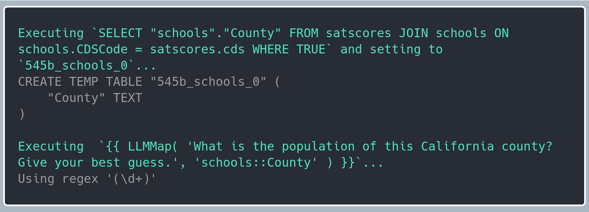

---
*The purpose of this post is to:*

  *1. Document some of my thoughts on combining language models with structured data*

  *2. Run some benchmarks with my new RTX 5080 🙂*

  *3. Extend an invitation to folks into database systems and language models to collaborate on BlendSQL - reach out at `parkervg5@gmail.com` if interested!*

---

## Inferring Generation Constraints

Love it or hate it, SQL is used everywhere. Because it is used everywhere, language models see a lot of it during pre-training. Even thinking outside of this complacent, hands thrown in the air ''well, there's nothing we can do to stop SQL...'' mindset, I genuinely believe it is a better basis for an intermediate representation than a pandas-like API.

What makes a 'better intermediate representation'? To me, is it the following:

1. **Token Efficiency**
  - How can we maximize the information density of our tokens? Can we achieve the same execution output with fewer tokens?
2. **Downstream Performance**
  - For a given task, does our intermediate representation execute to a result that is accurate?
3. **Ease of Acquisition**
  - Is our representation easy for a user - whether language model or human - to learn?[^1]

[^1]: I think about the [language strangeness budget](https://steveklabnik.com/writing/the-language-strangeness-budget/) a lot here.

What does it mean for BlendSQL to have 'type constraints'? We can use the following  from the TAG dataset as an example.

> How many test takers are there at the school/s in a county with population over 2 million?

The two tables in the database are shown below.

`schools`
|        CDSCode | StatusType   | County      | District               | School                          | Street                          |
|---------------:|:-------------|:------------|:-----------------------|:--------------------------------|:--------------------------------|
| 33672156107957 | Active       | Riverside   | Riverside Unified      | William Howard Taft Elementary  | 959 Mission Grove Parkway North |
| 15635371531300 | Closed       | Kern        | Kern Community College | Burroughs (Sherman E.) Evening  |                                 |
| 19647336120489 | Active       | Los Angeles | Los Angeles Unified    | Para Los Niños Charter          | 1617 East Seventh Street        |
| 01612596085781 | Closed       | Alameda     | Oakland Unified        | Renaissance Alternative         | 314 E. 10th Street              |
| 19647336016539 | Active       | Los Angeles | Los Angeles Unified    | Coeur D'Alene Avenue Elementary | 810 Coeur D'Alene Avenue        |

`satscores`
|            cds | dname                             |   NumTstTakr |   AvgScrRead |   AvgScrMath |
|---------------:|:----------------------------------|-------------:|-------------:|-------------:|
| 30664643036001 | Capistrano Unified                |          406 |          537 |          530 |
| 54105460000000 | Tulare County Office of Education |           28 |          541 |          498 |
|  7617210000000 | Liberty Union High                |          815 |          493 |          485 |
| 44698070000000 | San Lorenzo Valley Unified        |          114 |          550 |          526 |
| 37682963730074 | Poway Unified                     |          345 |          551 |          568 |

In a [pandas-like API](https://github.com/TAG-Research/TAG-Bench/blob/76d5795d6e35f770894d3f180af58b6638964fcf/tag/hand_written.py#L51), this is represented as the program below:

```python
scores_df = pd.read_csv("../pandas_dfs/california_schools/satscores.csv")
schools_df = pd.read_csv("../pandas_dfs/california_schools/schools.csv")
unique_counties = pd.DataFrame(schools_df["County"].unique(), columns=["County"])
unique_counties = unique_counties.sem_map(
    "What is the population of {County} in California? Answer with only the number without commas. Respond with your best guess."
)
counties_over_2m = set()
for _, row in unique_counties.iterrows():
    try:
        if int(re.findall(r"\d+", row._map)[-1]) > 2000000:
            counties_over_2m.add(row.County)
    except:
        pass

schools_df = schools_df[schools_df["County"].isin(counties_over_2m)]
merged_df = pd.merge(scores_df, schools_df, left_on="cds", right_on="CDSCode")
prediction = int(merged_df["NumTstTakr"].sum())
```

In BlendSQL, we can write this as:

```sql
SELECT SUM(ss.NumTstTakr) AS TotalTestTakers
FROM satscores ss
JOIN schools s ON s.CDSCode = ss.cds
WHERE {{
    LLMMap(
	    'Approximately, what is the population of this California county?',
	    's::County'
	)
}} > 2000000
```


Why does the difference between the two programs matter?

### Query Optimizations

In the pandas-style API, the user has to take special care in writing an optimized version of the structured operations. In fact, the code as-written is not optimized: since the `pd.merge` happens after the call to the language model in `sem_map`, we may have invoked the language model on rows of data that could have been filtered out ahead of time in the merge/`JOIN` operation! This has the potential to result in unneeded, expensive calls to the language model.

By building off of well-studied query optimizations in SQL, the responsibility for query optimizations falls to the execution engine, not the user. We follow a naive but effective heuristic for cost estimation during query planning: set all language model calls to a cost of $∞$, and native SQL calls to $0$.

This isn't quite as absurd as it seems. Since BlendSQL compiles to SQL at the end of the day, we get to rely on the amazing optimizations that folks at PostgreSQL, SQLite, and DuckDB have worked hard on. When we execute the above BlendSQL script, we get the following logging messages (enabled via `verbose=True`):



This gives us a peek into the query optimizations going on behind the scenes. First, we execute the much less expensive `JOIN` clause, transforming the `SUM(ss.NumTstTakr) AS TotalTestTakers` node in the `FROM` clause to `"schools"."County"`. Why do we do this? In an effort to leverage the highly optimized SQLite database management system as much as possible, there's no need to eagerly materialize any other columns - the language model only needs access to the `County` column of the `schools` table.

Additionally, when we execute the `LLMMap` function, it will handle the `DISTINCT` logic for us, making sure we don't invoke the language model for the population of Los Angeles more than once.

### Type Constraints

See the bit in the logs above that says `Using regex '(\d+)'`? This is telling us something about the type of constrained decoding we're performing.

What is constrained decoding? In short, it is a set of techniques that limits a language model's generation at the decoding level, such that it adheres to a previously defined structure.[2] Importantly, the novelty of BlendSQL isn't from the ability to constrain language models according to some regular expression or context-free grammar. We can credit projects like [guidance](https://github.com/guidance-ai/guidance) and [outlines](https://github.com/dottxt-ai/outlines) for that. Instead, the novelty of BlendSQL is its ability to **infer these constraints according to the surrounding SQL syntax**.

[^2] I highly reccomend [this .txt blog](https://blog.dottxt.co/coalescence.html) for a more in-depth explanation.

SQL, as a grammar, has a lot of rules. Just take [these SQLite syntax diagrams](https://www.sqlite.org/syntaxdiagrams.html), for example. These rules include things like, `IN` statement should be followed by a tuple of items, `<`, `>`, should contain numerics or dates, but `=` could contain any datatype, etc. We can use these to inform language-model functions, which we call 'ingredients', and denote in double curly brackets (`{{` and `}}`).

As a result, the output of the scalar `LLMMap` function is restricted to a string matching the regular expression `(\d+)`. We know that this is the datatype we expect, since after traversing the [AST](https://en.wikipedia.org/wiki/Abstract_syntax_tree) of the query, we see a 'greater-than' predicate with the integer `2000000` on the right-hand side. In order for this to be a grammatically valid SQLite predicate, the left-hand side of the `>` expression should match this type.[3]

[^3] SQLite uses [type affinity](https://www.sqlite.org/datatype3.html#affinity), meaning that in the clause `WHERE an_int_column > '3000'`, the string `'3000`' will get coerced into a integer, and all will be well. But, if the language model outputs something like `'Answer: 3,000'` (or even just `'3,000'`), then type affinity can't save us.

## Benchmarking
